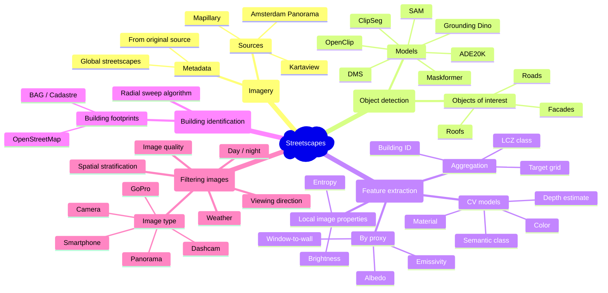

[](https://doi.org/10.5281/zenodo.14283533)
[](https://pypi.org/project/streetscapes/)
[](https://research-software-directory.org/software/streetscapes)
[](https://streetscapes.readthedocs.io/en/latest/)
[](https://doi.org/10.5281/zenodo.14283533)
[](https://pypi.org/project/streetscapes/)
[](https://research-software-directory.org/software/streetscapes)
[](https://streetscapes.readthedocs.io/en/latest/)



# Streetscapes

`streetscapes` is a Python package and CLI for large-scale analysis of street-level imagery. It bundles functionality ranging from imagery retrieval to segmentation, feature extraction, and building-level aggregation. The package is designed to be transparent, reproducible, and easy to extend for research use.

## Installation

```bash
pip install streetscapes
```

Model weights are downloaded automatically on first use.

## Example Workflow

Consider generating **albedo and emissivity maps for WRF input** over Amsterdam. The workflow shows how the CLI performs heavy tasks while the API complements further analysis.

```bash
# 1. Set active project
streetscapes config set active_project amsterdam
# 2. Fetch metadata for your area of interest using the Mapillary source
streetscapes fetch-metadata mapillary --bbox  4.87 52.36 4.91 52.39
# 3. Fetch images from mapillary
streetscapes download-images mapillary
# 4.1. Segment images with maskformer using a subset of labels
streetscapes segment_images maskformer --labels building --labels vegetation --labels wall
# 4.2. Segment images with Building/Facade Material Segmentation model (bfms)
streetscapes segment_images bfms
# 4.3 Segment images with DinoSAM using a custom prompt
streetscapes segment_images dinosam --prompt 'building vegetation car truck road'
```

<!-- Potential other commands to be implemented
```bash
# 1. Fetch metadata for your area of interest (Global Streetscapes dataset)
streetscapes fetch-metadata global-streetscapes \
  --bbox 4.87,52.36,4.91,52.39 \
  --output ./metadata.geoparquet

# 2. Filter images by type and quality
streetscapes filter-images ./metadata.geoparquet \
  --type panorama --quality high \
  --output ./filtered_meta.geoparquet

# 3. Download the filtered images
streetscapes download-images global-streetscapes ./filtered_meta.geoparquet \
  --output ./images

# 4. Detect and segment facades, roofs, and roads (DinoSAM)
streetscapes segment-images dinosam ./images \
  --prompt "facade, roof, road" \
  --output ./segments

# 5. Material recognition on segmented facades
streetscapes segment-images bfms ./segments \
  --output ./materials

# 6. Match segmented objects and materials to building footprints
streetscapes match-buildings ./segments.geoparquet ./footprints.geoparquet \
  --materials ./materials.geoparquet \
  --output ./buildings.geoparquet
``` -->

After CLI processing, the API enables flexible post-processing, visualization, and rasterization.

```python
import streetscapes

# Load outputs
buildings = streetscapes.load_geoparquet("./buildings.geoparquet")
segments = streetscapes.load_geoparquet("./segments.geoparquet")
materials = streetscapes.load_geoparquet("./materials.geoparquet")

# Visualize a sample image's detections
streetscapes.vis.plot_grounding_dino_boxes(segments.iloc[0])
streetscapes.vis.plot_dinosam_segments(segments.iloc[0])
streetscapes.vis.plot_materials(materials.iloc[0])
```

For advanced processing, we can leverage DuckDB spatial via Ibis. 
For example, once we have image-derived material estimates for building facades, 
we can map each material to literature-based albedo and emissivity values and 
aggregate these properties per building:

```py
import ibis
import duckdb

# Connect to DuckDB
con = ibis.duckdb.connect()

# Register tables
con.register("segments", "segments.geoparquet")        # segments with building_id & material_class
con.register("material_lookup", "material_properties.parquet")  # material_class -> albedo/emissivity
con.register("buildings", "buildings.geoparquet")      # building footprints

# Aggregate albedo/emissivity per building
agg_expr = con.sql("""
WITH seg_materials AS (
    SELECT
        s.building_id,
        l.albedo,
        l.emissivity
    FROM segments s
    JOIN material_lookup l
      ON s.material_class = l.material_class
    WHERE s.building_id IS NOT NULL
)
SELECT
    building_id,
    AVG(albedo) AS avg_albedo,
    AVG(emissivity) AS avg_emissivity
FROM seg_materials
GROUP BY building_id
""")

# Execute and save results
df_result = agg_expr.execute()
df_result.to_parquet("wrf_facade_features.parquet")
```

## Recommended Output Directory Structure

All CLI and API outputs are stored under a configurable base directory (default: `output/`). You can set the base directory via `.env` (e.g., `DATA_HOME=output`) or CLI options.

Example structure:

```
output/
  manifests/           # All metadata manifests (GeoParquet, CSV, etc.)
  images/              # All raw images (optionally flat, or sharded for scale)
  segmentation/
    sam_masks/         # All SAM masks
    groundingdino_bboxes/ # All GroundingDINO bboxes
    props/             # Other image properties
  footprints/          # Building footprints and spatial outputs
  cache/               # Intermediate files, DuckDB, temp data
  logs/                # CLI and workflow logs
```

- Images can be sharded by hash or ID for scalability
- Segmentation outputs are grouped by type/model
- The base directory is always configurable via `.env` (`DATA_HOME`) or CLI options.

## Design Philosophy

* **Transparency & simplicity**: clear, modular steps; no hidden initializations.
* **Composable CLI + API**: CLI handles heavy lifting; API enables filtering, visualization, and aggregation.
* **Geoparquet outputs**: fast spatial queries and incremental writes via `ibis` + `duckdb_spatial`.
* **Research-friendly**: easy to inspect, copy, and adapt.

## Contributing and publishing

If you want to contribute to the development of streetscapes,
have a look at the [contribution guidelines](CONTRIBUTING.md).

## 🪪 Licence

`streetscapes` is licensed under [`CC-BY-SA-4.0`](https://creativecommons.org/licenses/by-sa/4.0/deed.en).

## 🎓 Acknowledgements and citation

This repository uses the data and work from the [Global Streetscapes](https://ual.sg/project/global-streetscapes/) project.

> [1] Hou Y, Quintana M, Khomiakov M, Yap W, Ouyang J, Ito K, Wang Z, Zhao T, Biljecki F (2024): Global Streetscapes — A comprehensive dataset of 10 million street-level images across 688 cities for urban science and analytics. ISPRS Journal of Photogrammetry and Remote Sensing 215: 216-238. doi:[10.1016/j.isprsjprs.2024.06.023](https://doi.org/10.1016/j.isprsjprs.2024.06.023)

> TODO: add BFMS, ZFMS, ...

The `streetscapes` package can be cited using the supplied [citation information](https://docs.github.com/en/repositories/managing-your-repositorys-settings-and-features/customizing-your-repository/about-citation-files). For reproducibility, you can also cite a specific version by finding the corresponding DOI on [Zenodo](https://zenodo.org/records/14287547).
