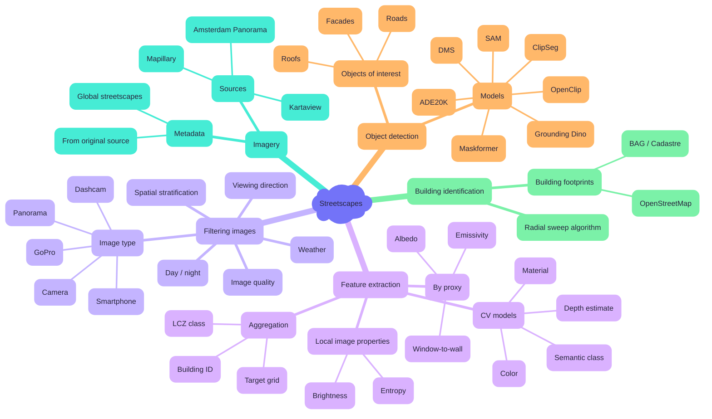

[](https://doi.org/10.5281/zenodo.14283533)
[](https://pypi.org/project/streetscapes/)
[](https://research-software-directory.org/software/streetscapes)
[](https://streetscapes.readthedocs.io/en/latest/)



# Streetscapes

`streetscapes` is a Python package and CLI for large-scale analysis of street-level imagery.
It bundles functionality ranging from imagery retrieval to segmentation, feature extraction, and building-level aggregation. The package is designed to be transparent, reproducible, and easy to extend for research use.

## Overview

The scope of `streetscapes` spans the entire workflow from raw imagery to derived geospatial features. The mindmap below illustrates the different components:


## Installation

```bash
pip install streetscapes
```

Model weights are downloaded on first use of each model.

## Example Workflow

To show how `streetscapes` structures end-to-end analysis, consider the task of generating **albedo and emissivity maps for input into WRF**.

The **CLI** handles the heavy, resource-intensive steps (fetching metadata, downloading images, segmenting, feature extraction, building matching).
The **API** complements this by making it easy to process CLI outputs in Python, for tasks such as filtering, visualization, and aggregation.

```bash
# 1. Fetch metadata for available images in your area of interest
streetscapes fetch-metadata mapillary \
  --bbox <west,south,east,north> \
  --output images_meta.geoparquet

# 2. Download the referenced images
streetscapes download-images mapillary images_meta.geoparquet --output ./images

# 3. Detect and segment facades, roofs, and roads
streetscapes segment-images dinosam ./images \
  --prompt "facade, roof, road" \
  --output ./segments

# 4. Match segmented objects to building footprints
streetscapes match-buildings ./segments.geoparquet ./footprints.geoparquet --output ./buildings.geoparquet

# 5. Derive features such as albedo and emissivity per building
streetscapes extract-features ./buildings.parquet --output ./wrf_inputs
```

After these CLI steps, further analysis can continue in Python with the API:

```python
import streetscapes

# Load outputs
buildings = streetscapes.load_geoparquet("./wrf_inputs/buildings.parquet")

# Visualize detected facades for a sample building
streetscapes.vis.show_building_crops(buildings, building_id=12345)

# Filter buildings by facade coverage
filtered = streetscapes.analysis.filter_by(buildings, min_facade_fraction=0.3)
```

## Design Philosophy

* **Transparency & simplicity**: functionality is implemented in small, clear steps; no hidden initializations or complex class hierarchies.
* **Composable CLI + API**: the CLI performs heavy lifting, while the API enables flexible post-processing, filtering, and visualization.
* **Geoparquet outputs**: results are stored as geoparquet, enabling fast spatial queries and incremental writes via `ibis` + `duckdb_spatial`.
* **Research-friendly**: code is easy to understand, copy, and adapt for new experiments or pipelines.

## Contributing and publishing

If you want to contribute to the development of streetscapes,
have a look at the [contribution guidelines](CONTRIBUTING.md).

## 🪪 Licence

`streetscapes` is licensed under [`CC-BY-SA-4.0`](https://creativecommons.org/licenses/by-sa/4.0/deed.en).

## 🎓 Acknowledgements and citation

This repository uses the data and work from the [Global Streetscapes](https://ual.sg/project/global-streetscapes/) project.

> [1] Hou Y, Quintana M, Khomiakov M, Yap W, Ouyang J, Ito K, Wang Z, Zhao T, Biljecki F (2024): Global Streetscapes — A comprehensive dataset of 10 million street-level images across 688 cities for urban science and analytics. ISPRS Journal of Photogrammetry and Remote Sensing 215: 216-238. doi:[10.1016/j.isprsjprs.2024.06.023](https://doi.org/10.1016/j.isprsjprs.2024.06.023)

> TODO: add BFMS, ZFMS, ...

The `streetscapes` package can be cited using the supplied [citation information](https://docs.github.com/en/repositories/managing-your-repositorys-settings-and-features/customizing-your-repository/about-citation-files). For reproducibility, you can also cite a specific version by finding the corresponding DOI on [Zenodo](https://zenodo.org/records/14287547).
